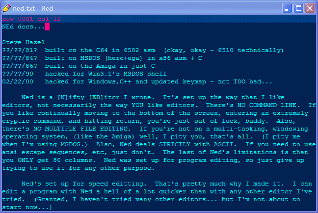

# shazware -- [S]teve [HAZ]el's soft[WARE]

environment:  Qt c++ in a flatpak

Uses my stv library of c++ assumed to be in ../stv
CMakeList.txt s have ../../stv/os.cpp, ../../stv/ui.cpp, etc


--------------------------------------------------------------------------------

## fp2sh

* console app
```
php script to make a bunch of short bash scripts in current dir 
of all flatpak commands on your system
Or you could just do this manually, too:

sh@penguin:~/.bin$ cat ftx
/usr/bin/flatpak run --branch=master --arch=x86_64 --command=ftx 
--file-forwarding app.shaz.shazware  $@

(sorry for it being in php - i'm just not python guy)
```
--------------------------------------------------------------------------------

## big

* console app
```
dumps a big "font" to the ole console.
relive the mainframe days.

    sh@penguin:~/src$ big how are you
    HH        HH   OOOOOOOOOO   WW        WW
    HH        HH  OOOOOOOOOOOO  WW        WW
    HH        HH  OO        OO  WW        WW
    HH        HH  OO        OO  WW        WW
    HH        HH  OO        OO  WW        WW
    HHHHHHHHHHHH  OO        OO  WW   WW   WW
    HHHHHHHHHHHH  OO        OO  WW  WWWW  WW
    HH        HH  OO        OO  WW WWWWWW WW
    HH        HH  OO        OO  WWWWW  WWWWW
    HH        HH  OO        OO  WWWW    WWWW
    HH        HH  OOOOOOOOOOOO  WWW      WWW
    HH        HH   OOOOOOOOOO   WW        WW


       AAAAAA     RRRRRRRRRRR   EEEEEEEEEEEE
      AAAAAAAA    RRRRRRRRRRRR  EEEEEEEEEEEE
     AA      AA   RR        RR  EE
    AA        AA  RR        RR  EE
    AA        AA  RR        RR  EE
    AA        AA  RRRRRRRRRRRR  EEEEEE
    AAAAAAAAAAAA  RRRRRRRRRRR   EEEEEE
    AAAAAAAAAAAA  RR    RR      EE
    AA        AA  RR     RR     EE
    AA        AA  RR      RR    EE
    AA        AA  RR       RR   EEEEEEEEEEEE
    AA        AA  RR        RR  EEEEEEEEEEEE


    YY        YY   OOOOOOOOOO   UU        UU
    YYY      YYY  OOOOOOOOOOOO  UU        UU
     YYY    YYY   OO        OO  UU        UU
      YYY  YYY    OO        OO  UU        UU
       YYYYYY     OO        OO  UU        UU
        YYYY      OO        OO  UU        UU
         YY       OO        OO  UU        UU
         YY       OO        OO  UU        UU
         YY       OO        OO  UU        UU
         YY       OO        OO  UU        UU
         YY       OOOOOOOOOOOO  UUUUUUUUUUUU
         YY        OOOOOOOOOO    UUUUUUUUUU


    sh@penguin:~/src$ big -i man
               MM        MM     AAAAAA     NN        NN
              MMM      MMM    AAAAAAAA    NNN       NN
             MMMM    MMMM   AA      AA   NNNN      NN
            MMMMM  MMMMM  AA        AA  NNNNN     NN
           MM MMMMMM MM  AA        AA  NN NNN    NN
          MM  MMMM  MM  AA        AA  NN  NNN   NN
         MM   MM   MM  AAAAAAAAAAAA  NN   NNN  NN
        MM        MM  AAAAAAAAAAAA  NN    NNN NN
       MM        MM  AA        AA  NN     NNNNN
      MM        MM  AA        AA  NN      NNNN
     MM        MM  AA        AA  NN       NNN
    MM        MM  AA        AA  NN        NN
```
--------------------------------------------------------------------------------

## flatten
```
flatten all the files in the subdirs of a top dir into the top dir as
   subdir1_subsubdir1_filename.txt
   
BE CAREFUL - this can really mess up your files !!
Usually, you'll want to COPY the dir before you flatten it.
So you've still got your dir'd files.
```

--------------------------------------------------------------------------------

## ftx
```
find text
look for a text string in all files under a top dir.
Case is ignored as it should be.
No dang stars or greppy stuff.
```

--------------------------------------------------------------------------------

## l

* console app
```
my replacement for ls - i know i know - leave me be
```
--------------------------------------------------------------------------------

## ned 
```
Nifty text EDitor

an old school 80 columns monospace (ONLY!) text editor.
   originally on the C=64 in 6510 asm.
   then to C on Amiga500
   then msdos
   then MacClassic
   then on win95/10 in C++ with win32api
   then on chromeos with Qt
   then on RasPi64
   then on kubutu
   now a flatpak
   
NEd is built for me.  You may have limited success with it :)
Just warnin ya...
I've used it EVERY time i've sat down to REALLY write some code.

Below is the keymap.  Below that, the commands described
(in excruciating detail)
```

```
###KeyMap
 CTL u    Up
 CTL m    Dn
 CTL j    Rit
 CTL h    Lft
 CTL y    PgUp
 CTL n    PgDn
 CTL '    WrdRit
 CTL /    WrdEnd
 CTL ;    WrdLft
     UP   Up
     DN   Dn
     RIT  Rit
     LFT  Lft
     HOM  Top
     END  Bot
     PUP  PgUp
     PDN  PgDn
     INS  TglOver
 CTL k    Del
     DEL  Del
     BSP  Lft Del
     TAB  Tab
 CTL 8    Cntr
     RET  Rtrn
 CTL RET  Split
 CTL ,    DelRow
 CTL o    DelWrdRit
 CTL i    DelWrdLft
 CTL p    PutBlk
 CTL [    BlkBgn PutBlk
 CTL ]    BlkEnd PutBlk
 CTL a    BlkAll PutBlk
 CTL 0    BlkRit
 CTL 9    BlkLft
 CTL BSP  BlkDel
 CTL =    BlkCopy
 CTL -    BlkMove
 CTL \    BlkFmt
 CTL c    BlkCpy
 CTL v    BlkPst
 CTL f    Find
 CTL g    FindNxt
 CTL r    Rplc
     F01  Load
     F02  Save
     F03  SaveAs
     F06  Wipe
     F05  Quit
     ESC  Save Quit
     F11  TglSqnc
     F12  RptSqnc
 CTL ALT ,    UnDelRow
 CTL SHF SPC  UpCase Rit
 CTL     SPC  LoCase Rit

###cursor commands
 - Rit cursor right, stop at column 80

 - Lft
   cursor left, stop at column 1

 - Up
   cursor up, stop at row 1

 - Dn
   cursor down, stop at row MAX_ROW, (#define'd in Ned.h)

 - Top
   move screen to get row 1 at the screen top

 - Bot
   move screen to get last used row of text at the screen bottom

 - PgUp
   move up half a screen, stop when row 1's at the top

 - PgDn
   move down half a sceen, stop when last used row is at bot of screen

 - WrdRit
   move to first char of next word, else end of row, else col 0 next row

 - WrdLft
   move to first char of prev word, else col 0, else end of prev row

 - WrdEnd
   move to first space after next word, else end of row, else col 0 of next row

###insert/delete commands
 - TglOver
   toggle overwrite mode, reflected in title bar

 - TglWrap
   toggle wrap mode (whoops, this isn't implemented yet...)

 - Del
   delete character under cursor, scoot stuff left
   (backspace is a macro of 'Lft Del')

 - Tab
   insert spaces up to first char of next word in prev row

 - Cntr
   center the cursor row

 - Rtrn
   cursor column to 1, move down a row, insert a row, indent

 - Split
   move characters at and after the cursor to cursor pos after a Rtrn

 - InsRow
   insert a row at the cursor, scoot cursor and following ones down

 - DelRow
   delete cursor row, scoot following ones up

 - DelWrdRit
   if past end of line and next row will fit at cursor, move it up
   else if on a space, do Del til cursor's on a non space
   else do Del til cursor's on a space

 - DelWrdLft
   if in col 1 and row will fit at end of prev row, move it up
   else if prev col of cursor is a space, do BkSpc til it's a non space
   else do BkSpc til it's a space

###block commands
note: all block commands work with ROW or BOX blocks.
if BlkBgnCol == BlkEndCol, you are specifying a ROW block: all cols are used.
otherwise, you are specifying a BOX block, only the specified cols are used.

 - PutBlk
   flash the current block location on the screen
   (block is colored for a short time, then restored to normal color)

 - BlkBgn
   set block's top left corner   (BlkBgnCol and BlkBgnRow)

 - BlkEnd
   set block bottom right corner (BlkEndCol and BlkEndRow)

 - BlkAll
   select all the text

 - BlkRit
   BOX: shift box right.  doesn't do it if left  col has non spaces
   ROW: shift whole row.

 - BlkLft
   BOX: shift box left.   doesn't do it if right col has non spaces
   ROW: shift whole row.

 - BlkDel
   BOX: delete columns marked, but rows not lost.
   ROW: delete the rows marked.

 - BlkCopy
   BOX: copy the marked cols.  (top left corner to where the cursor is)
   ROW: copy the marked rows.  (insert in front of cursor row)

 - BlkMove
   BlkCopy, then BlkDel

 - BlkFmt
   BOX: arrange marked rows into paragraph format, using the block cols
   as margins.
   ROW: use 1 and 80 as margins.

 - BlkCpy
   clipboard copy (box or row block)

 - BlkPst
   clipboard paste (single line if it fits, else row block)

###find/replace commands
 - Find
   prompt for a find string, find it (starting from cursor location)

 - ReFind
   find last string prompted for

 - Rplc
   find&replace thru whole file.  when prompted, press y to replace,
   n to skip, q to quit.  restore cursor.

###IO commands
 - Wipe
   clear out all the text in memory.  (UnDelRow info gets cleared too)

 - Name
   rename the editor file for saving (or loading if there's no text)

 - Load
   load 'filename' if no text, else prompt for a file to ins at cursor

 - Save
   save editor file under 'filename' (doesn't Quit)

 - Quit
   quit Ned (without saving)

###other commands
 - UnDelRow
   undelete last deleted row, note that there may be some trailing junk
   characters due to the loss of row length info

 - TglSqnc
   toggle "sequence" (macro) mode.
   if toggled on,  clear sqnc buf, start storing keystrokes in Sqnc buf.
   if toggled off, stop storing keystrokes in Sqnc buffer.

 - RptSqnc
   play back all keystrokes in Sqnc buf

 - UpCase
   convert case of cursor char to upper case

 - LoCase
   convert case of cursor char to lower case

 - EndCmd
   used internally for ending macros
   
```
--------------------------------------------------------------------------------

## recent

* console app
```
list file mod dates under a top dir (like ls -ltr but all subdirs, nicer format)
```
--------------------------------------------------------------------------------

## renem
```
rename em - rename all files under a top dir via text editing.

it makes a file listing in a .txt file 
   for you to just overtype with ned.  ok ok or your text editor.
Then it renames the ones you overtyped.  
   Keep them on the same line.
   Can't remember if you can change the path or not..:/

Search and replace while renaming files :)
```
--------------------------------------------------------------------------------

## undup
```
find and kill duplicate files in a top level dir (and subdirs, etc)

works similar to renem, but groups files with empty lines.

I've got a ton of midi files I've scammed off various web spots.
And -NONE- of em had nice clean names.
They're either named AWESOMEMID.MID or else flying_in_a_blue_dream_by_joe.KAR...
I want it named JoeSatriani_FlyingInABlueDream_lyr.mid

And then I come across the file again.
This time it's named WAYCOOL.MID (didn't you love those 8.3 char DOS filenames?)

I've got jillions of files!  How do I get rid of the duplicates???

Welllllllll, UnDup of -COURSE-  (Durrrrr!)

right click a directory in windows explorer

UnDup will pop up notepad with the full listing of the dups

It doesn't know which one of the 2+ files to keep, though.
If it guesses wrong,

- prefix an x (and space) to the one it picked.

- delete the x by the file to keep

save !

then click yes to actually kill em.  (or no to skip it)
```
--------------------------------------------------------------------------------
